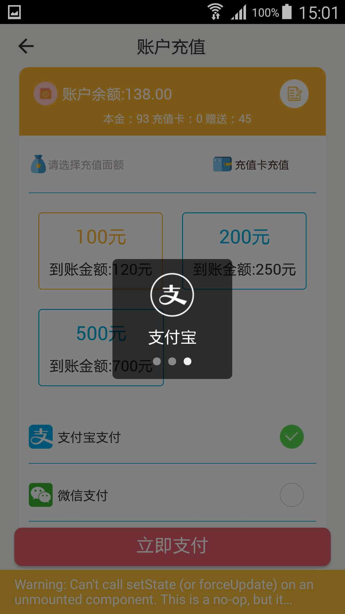

# react-native-yunpeng-alipay

React Native Module for alipay.com

# Introduction
- 该组件用于调起支付宝app 适用于安卓和IOS ，应用场景目前主要是调起支付宝支付。

# Use Case
- 支付宝支付
  
# Effect Picture
  - 支付宝支付效果
  
<a></a>
<a></a>
<a></a>
<a></a>

  
  
  
# 使用方法

## install

```
npm install react-native-yunpeng-alipay --save
```

## Android

### With rnpm

```
rnpm link react-native-yunpeng-alipay
```

### Manually

* android/settings.gradle

```
include ':react-native-yunpeng-alipay'
project(':react-native-yunpeng-alipay').projectDir = new File(rootProject.projectDir, '../node_modules/react-native-yunpeng-alipay/android')
```

* android/app/build.gradle

```
dependencies {
    compile project(':react-native-yunpeng-alipay')
}
```

* register module (in MainActivity.java)

```java
...

import com.yunpeng.alipay.AlipayPackage; // <--- IMPORT

public class MainActivity extends ReactActivity {

    ...

    @Override
    protected List<ReactPackage> getPackages() {
        return Arrays.<ReactPackage>asList(
            new MainReactPackage(),
            new AlipayPackage() // <--- ADD HERE
        );
    }
}
```

## iOS

### With rnpm

```
rnpm link react-native-yunpeng-alipay
```

### Manually

> Link `AlipayModule` library from your `node_modules/react-native-yunpeng-alipay/ios` folder like its [described here](http://facebook.github.io/react-native/docs/linking-libraries-ios.html). Don't forget to add it to "Build Phases" of project.

### Config

* Added the following libraries to your "Link Binary With Libraries":
  * [x] CoreMotion.framework
  * [x] CoreTelephony.framework
  * [x] libc++
  * [x] libz
  
* add `URL Schema` as your app id for `URL type` in `Targets - info`
* Make sure you have these code in AppDelegate.m to enable callback

```objective_c
#import "AlipayModule.h"
```

```objective_c
- (BOOL)application:(UIApplication *)application openURL:(NSURL *)url
  sourceApplication:(NSString *)sourceApplication annotation:(id)annotation
{
  [AlipayModule handleCallback:url];
  return YES;
}
```

### General Usage

- Alipay.pay(data)中的data是服务端生成的订单信息，需要先调用一个接口请求，然后才可以进行 支付调用

```javascript
import Alipay from 'react-native-yunpeng-alipay';

```

```javascript
Alipay.pay("signed pay info string").then(function(data){
                    console.log(data);
                }, function (err) {
                    console.log(err);
                });

```
